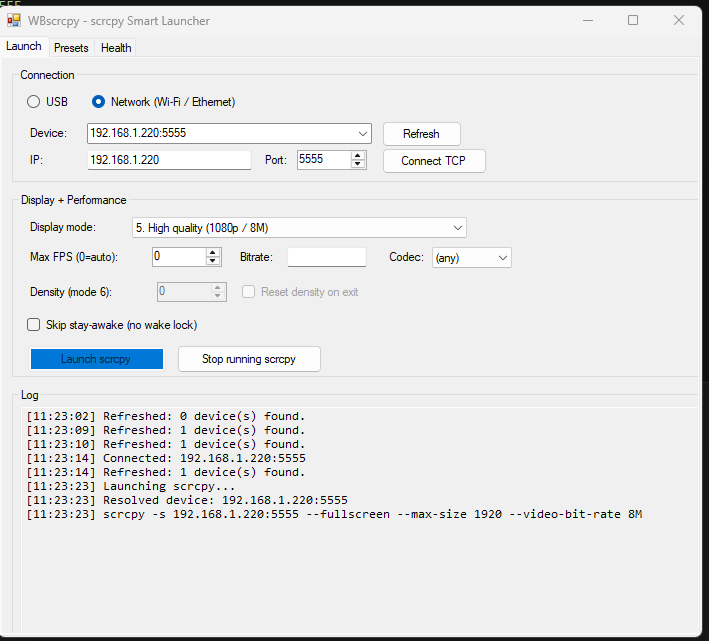
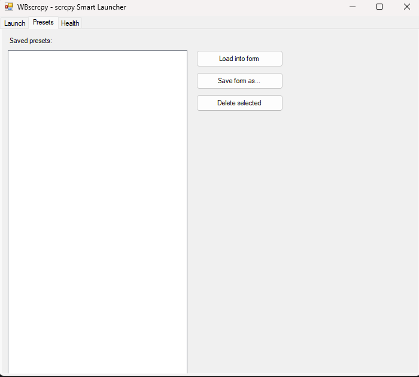
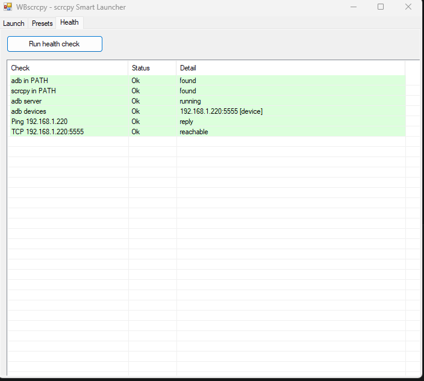
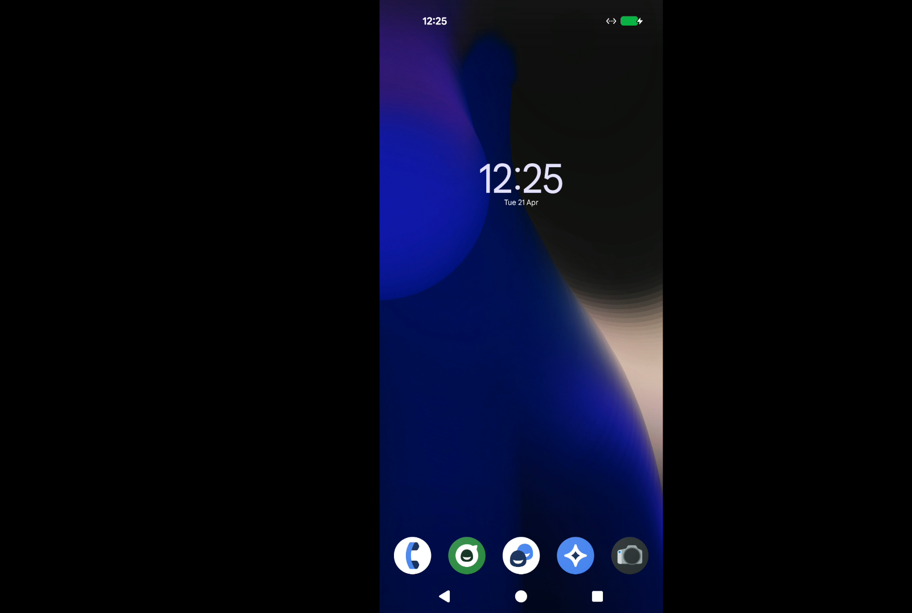

<div align="center">

# WB's scrcpy Launcher

**A polished PowerShell + WinForms GUI wrapper for [scrcpy](https://github.com/Genymobile/scrcpy).**  
Mirror and control your Android device over USB or Wi-Fi — with named presets, health diagnostics, a guided CLI, and a click-friendly GUI you can compile into a standalone `.exe`.

[](#requirements)
[](#requirements)
[](LICENSE)
[](https://buymeacoffee.com/succinctrecords)

</div>

---

## Contents

- [What you get](#what-you-get)
- [Screenshots](#screenshots)
- [Project files](#project-files)
- [Requirements](#requirements)
- [Installation](#installation)
- [Three ways to run](#three-ways-to-run)
- [GUI walkthrough](#gui-walkthrough)
  - [Launch tab](#launch-tab)
  - [Presets tab](#presets-tab)
  - [Health tab](#health-tab)
- [CLI usage](#cli-usage)
  - [Parameters](#parameters)
  - [Display modes](#display-modes)
  - [Examples](#examples)
- [Preset system](#preset-system)
- [Health check](#health-check)
- [Building the .exe](#building-the-exe)
- [Architecture](#architecture)
- [Support](#support)
- [License](#license)

---

## What you get

| Front-end | File | Best for |
|---|---|---|
| **GUI** | `WBscrcpy.Gui.ps1` / `WBscrcpy.exe` after build | Everyone — click, configure, launch. |
| **CLI** | `WBscrcpy.ps1` | Scripting, hotkeys, automation. |
| **Core lib** | `WBscrcpy.Core.psm1` | Shared logic — both front-ends import it. |

Features across both:

- USB and Wi-Fi/Ethernet (TCP/IP) connections with auto `adb connect` and retry.
- 6 display modes — normal window, fullscreen, screen-off, borderless, high quality (1080p/8M), custom DPI.
- Per-session FPS cap, bitrate, and codec choice (H.264 / H.265 / AV1).
- Custom display density for desktop-style layouts, with guaranteed restore on exit.
- Stay-awake wake-lock with **guaranteed cleanup** even on Ctrl-C or window close.
- Named presets saved to `WBscrcpy.presets.json` — load, save, list, delete.
- Full health-check diagnostics covering `adb`, `scrcpy`, network, and device state.
- Multi-device aware — pick from a dropdown or target a serial directly.

---

## Screenshots

**Launch tab — Network mode, device connected, scrcpy running**



**Presets tab**



**Health tab — all checks passing**



**Result — Android device mirrored on the desktop**



---

## Project files

```
WBs-Scrcpy/
├── WBscrcpy.Core.psm1   ← shared logic: ADB, presets, scrcpy launch
├── WBscrcpy.ps1         ← CLI front-end
├── WBscrcpy.Gui.ps1     ← WinForms GUI front-end
├── Build-Exe.ps1        ← compiles GUI/CLI into a standalone .exe via ps2exe
├── Screenshots/         ← screenshots used in this README
├── README.md
├── LICENSE
└── .gitignore
```

---

## Requirements

| Tool | Notes |
|---|---|
| **Windows 10/11** | The WinForms GUI is Windows-only. |
| **PowerShell 5.1+** | Built into Windows. PowerShell 7+ also works. |
| **[scrcpy](https://github.com/Genymobile/scrcpy)** | Must be on `PATH`. `winget install Genymobile.scrcpy` is the easiest way. |
| **[ADB](https://developer.android.com/tools/adb)** | Bundled with scrcpy releases, or install the standalone Platform Tools. Must be on `PATH`. |
| **[ps2exe](https://github.com/MScholtes/PS2EXE)** *(optional)* | Only needed to build the `.exe`. `Build-Exe.ps1` installs it for you if it's missing. |

---

## Installation

```powershell
git clone https://github.com/your-username/WBs-Scrcpy.git
cd WBs-Scrcpy
```

That's it. No install step — it's just scripts.

> **Execution policy** — if Windows blocks script execution:
> ```powershell
> Set-ExecutionPolicy -Scope CurrentUser -ExecutionPolicy RemoteSigned
> ```

Verify your dependencies are in order before you start:

```powershell
Get-Command scrcpy, adb
.\WBscrcpy.ps1 -HealthCheck
```

---

## Three ways to run

```powershell
# 1. Standalone .exe (recommended — build once, double-click forever)
.\dist\WBscrcpy.exe

# 2. GUI script directly
.\WBscrcpy.Gui.ps1

# 3. CLI (interactive prompts, or fully scripted)
.\WBscrcpy.ps1
```

---

## GUI walkthrough

### Launch tab


This is where you configure and start a session.

**Connection section**

- **USB / Network radio** — switches the device list between USB-connected and TCP/IP devices. The dropdown auto-refreshes when you switch.
- **Device dropdown** — lists detected devices. Hit **Refresh** at any time to re-scan.
- **IP / Port fields** — only relevant in Network mode. Fill in your device's IP address (default `192.168.1.220`) and ADB port (default `5555`).
- **Connect TCP** — runs `adb connect IP:Port` so the device shows up in the dropdown. Useful when your phone isn't paired yet.

**Display + Performance section**

| Control | What it does |
|---|---|
| **Display mode** | One of six layouts — see [Display modes](#display-modes). |
| **Max FPS** | Cap the frame rate. `0` means let scrcpy decide. |
| **Bitrate** | Video bitrate, e.g. `8M`, `4M`. Leave blank for scrcpy's default. |
| **Codec** | `(any)`, `h264`, `h265`, or `av1`. |
| **Density (mode 6)** | Only enabled when display mode 6 is selected. Sets `adb shell wm density` before launch. |
| **Reset density on exit** | Restores the original DPI when the session ends. Only active with mode 6. |
| **Skip stay-awake** | Disables the wake-lock that keeps the screen on during mirroring. |

**Launch / Stop**

- **Launch scrcpy** — builds the argument list, resolves the device, and starts scrcpy. The live log below shows exactly what command ran.
- **Stop running scrcpy** — kills the running process. Wake-lock and density changes are cleaned up automatically regardless of how the session ends.

The **Log panel** at the bottom shows timestamps for every action — connects, refreshes, the exact scrcpy command, and exit codes.

---

### Presets tab


Presets let you save a full configuration (connection type, display mode, FPS, bitrate, codec, density, etc.) under a name so you can recall it in one click.

- **Load into form** — applies the selected preset to the Launch tab. The app switches to the Launch tab automatically.
- **Save form as…** — prompts for a name and saves the current Launch tab state to `WBscrcpy.presets.json`.
- **Delete selected** — removes the preset after a confirmation prompt.

Presets are stored in `WBscrcpy.presets.json` in the same folder as the scripts/exe. The file is gitignored so your personal presets don't end up in version control.

---

### Health tab


Click **Run health check** to run a full diagnostic sweep. Results appear in a colour-coded grid:

| Colour | Meaning |
|---|---|
| Green | All good |
| Yellow | Warning — something might not work as expected |
| Red | Failure — action required |

Checks performed:

- `adb` in PATH
- `scrcpy` in PATH
- ADB server running
- Connected device list (shows serials and states)
- Ping to the IP entered on the Launch tab
- TCP reachability on the configured port

This is the first thing to run if something isn't connecting.

---

## CLI usage

### Parameters

| Parameter | Type | Default | Description |
|---|---|---|---|
| `-Mode` | `Interactive` \| `USB` \| `Network` | `Interactive` | How to connect. |
| `-DefaultIP` | `string` | `192.168.1.220` | Fallback IP used in interactive mode. |
| `-DefaultPort` | `int` | `5555` | Fallback port used in interactive mode. |
| `-IP` | `string` | — | Device IP for Network mode. |
| `-Port` | `int` | — | ADB TCP port. |
| `-DeviceSerial` | `string` | — | Target a specific device by serial. For TCP devices use `IP:port`. |
| `-DisplayMode` | `1`–`6` | `1` | Display layout (see table below). |
| `-MaxFps` | `int` | — | FPS cap. |
| `-Bitrate` | `string` | — | Video bitrate, e.g. `8M`. |
| `-Codec` | `h264` \| `h265` \| `av1` | — | Video codec. |
| `-Density` | `int` | — | DPI 120–640. Required for mode 6. |
| `-ResetDensityOnExit` | `switch` | — | Restore original DPI when scrcpy exits. |
| `-LoadPreset` | `string` | — | Load a named preset. Explicit params still override preset values. |
| `-SavePreset` | `string` | — | Save the resolved config under this name after launch. |
| `-NoLaunch` | `switch` | — | Don't start scrcpy — useful paired with `-SavePreset` to save without launching. |
| `-ListPresets` | `switch` | — | Print all saved presets and exit. |
| `-HealthCheck` | `switch` | — | Run diagnostics and exit. |
| `-NoWakeLock` | `switch` | — | Skip the stay-awake wake-lock. |
| `-NoInteractiveTuning` | `switch` | — | Skip the FPS/codec/bitrate prompt in interactive mode. |
| `-Gui` | `switch` | — | Launch the GUI instead of running in CLI mode. |

### Display modes

| Mode | Description | scrcpy flags used |
|:---:|---|---|
| `1` | Normal window | *(none)* |
| `2` | Fullscreen | `--fullscreen` |
| `3` | Fullscreen + Screen OFF | `--fullscreen --turn-screen-off` |
| `4` | Borderless fullscreen | `--fullscreen --window-borderless` |
| `5` | High quality (1080p / 8 Mbps) | `--fullscreen --max-size 1920 --video-bit-rate 8M` (your `-Bitrate` overrides the 8M) |
| `6` | Custom DPI + Fullscreen + Screen OFF | `--fullscreen --turn-screen-off` + `adb shell wm density <Density>` |

### Examples

```powershell
# USB, borderless fullscreen
.\WBscrcpy.ps1 -Mode USB -DisplayMode 4

# Wi-Fi, fullscreen + screen off, 60 fps, H.265
.\WBscrcpy.ps1 -Mode Network -IP 192.168.1.42 -DisplayMode 3 -MaxFps 60 -Codec h265

# Load a preset and override one setting
.\WBscrcpy.ps1 -LoadPreset "TV" -Codec h265

# Save a preset without actually launching scrcpy
.\WBscrcpy.ps1 -Mode USB -DisplayMode 5 -MaxFps 120 -SavePreset "HighFPS" -NoLaunch

# Custom DPI session, restore DPI automatically on exit
.\WBscrcpy.ps1 -Mode USB -DisplayMode 6 -Density 240 -ResetDensityOnExit

# Target a specific device when multiple are connected
.\WBscrcpy.ps1 -Mode USB -DeviceSerial "ABCDEF123456" -DisplayMode 1

# Run a health check against a specific IP
.\WBscrcpy.ps1 -HealthCheck -IP 192.168.1.50 -Port 5555

# Just open the GUI
.\WBscrcpy.ps1 -Gui
```

---

## Preset system

Presets are stored in `WBscrcpy.presets.json` alongside the scripts/exe. They are gitignored.

**Resolution order** — later wins:
1. Built-in defaults (`New-LaunchConfig`)
2. Preset values (`-LoadPreset` or "Load into form")
3. Explicit CLI parameters or GUI form values

This means a preset is a *base*, not a lock. You can load "TV" and still pass `-Codec h265` to override just that one field.

In interactive CLI mode, if a preset is loaded the script skips re-prompting for the values already set by it — it only asks for what's still missing.

---

## Health check

```powershell
# Basic — checks adb, scrcpy, ADB server, connected devices
.\WBscrcpy.ps1 -HealthCheck

# With network checks against a specific device
.\WBscrcpy.ps1 -HealthCheck -IP 192.168.1.50 -Port 5555
```

Output example:

```
Check             Status  Detail
-----             ------  ------
adb in PATH       Ok      found
scrcpy in PATH    Ok      found
adb server        Ok      running
adb devices       Ok      192.168.1.220:5555 [device]
Ping 192.168.1.220  Ok    reply
TCP 192.168.1.220:5555  Ok  reachable
```

The GUI shows the same information in the colour-coded Health tab grid.

---

## Building the .exe

The build script uses [ps2exe](https://github.com/MScholtes/PS2EXE) to compile the GUI script into a native Windows executable. If ps2exe isn't installed, `Build-Exe.ps1` installs it for the current user automatically.

```powershell
# GUI exe (default — no console window, double-click friendly)
powershell -NoProfile -ExecutionPolicy Bypass -File .\Build-Exe.ps1

# CLI exe (with console window)
powershell -NoProfile -ExecutionPolicy Bypass -File .\Build-Exe.ps1 -Cli

# Build both
powershell -NoProfile -ExecutionPolicy Bypass -File .\Build-Exe.ps1 -Both

# Custom output directory and icon
powershell -NoProfile -ExecutionPolicy Bypass -File .\Build-Exe.ps1 -OutDir "C:\Apps\WBscrcpy" -IconPath ".\icon.ico"
```

Output goes into `dist/`:

```
dist/
├── WBscrcpy.exe          ← GUI executable (windowless)
├── WBscrcpy-cli.exe      ← CLI executable (only with -Cli or -Both)
└── WBscrcpy.Core.psm1    ← required — copied here automatically
```

> **Important:** `WBscrcpy.Core.psm1` must stay in the same folder as the `.exe`. The exe loads it at runtime.  
> The exe still requires `adb` and `scrcpy` to be on `PATH` (or placed in the same folder) on the target machine.

Once built you can pin `WBscrcpy.exe` to your taskbar or Start menu for one-click launches.

---

## Architecture

```
┌─────────────────────┐         ┌─────────────────────┐
│   WBscrcpy.ps1      │         │   WBscrcpy.Gui.ps1  │
│   (CLI front-end)   │         │   (WinForms front)  │
└──────────┬──────────┘         └──────────┬──────────┘
           │ Import-Module                  │ Import-Module
           ▼                                ▼
┌─────────────────────────────────────────────────────┐
│              WBscrcpy.Core.psm1                     │
│   Get-AdbDevice • Resolve-UsbDevice •               │
│   Connect-AdbNetworkDevice • Build-ScrcpyArgs •     │
│   Invoke-Scrcpy (try/finally cleanup) •             │
│   Import/Export-Presets • Invoke-HealthCheck        │
└──────────────────────┬──────────────────────────────┘
                       │ shells out
                       ▼
                ┌─────────────┐    ┌─────────────┐
                │   adb.exe   │    │ scrcpy.exe  │
                └─────────────┘    └─────────────┘
```

**What happens when you hit Launch:**

1. Validate `adb` and `scrcpy` are on PATH, start the ADB server.
2. Resolve the device — USB auto-select or `adb connect IP:Port` with 3 retries.
3. Disconnect any stale TCP sessions (logged).
4. If mode 6: apply `adb shell wm density <value>`.
5. Enable stay-awake wake-lock.
6. Start scrcpy and wait. The GUI returns the process object so it can poll for exit.
7. **`finally` block** — always runs, even on crash/Ctrl-C/Stop button: disable wake-lock, reset density if requested.

---

## Support

If this saved you some time or ADB headaches, a coffee is always appreciated:

<a href="https://buymeacoffee.com/succinctrecords"></a>

---

## License

MIT — see [LICENSE](LICENSE).

---

<div align="center">
Made with ☕ and way too many ADB flags.
</div>
